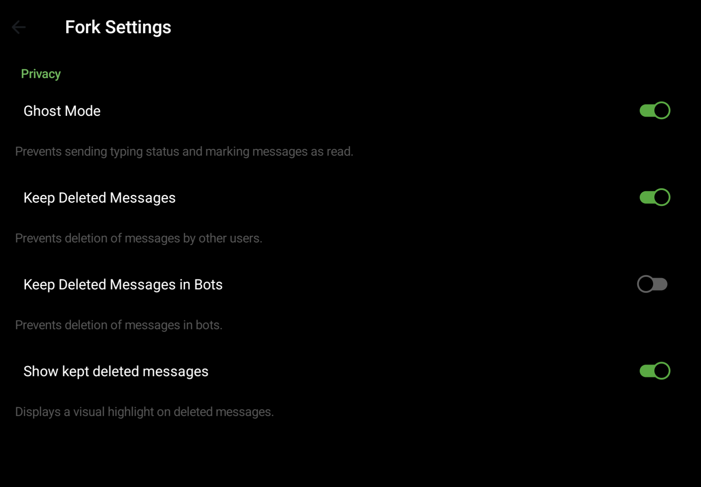

## MyGram — Fork of Telegram for Android

[Telegram](https://telegram.org) is a messaging app with a focus on speed and security. It's superfast, simple and free.

This is a modified fork of [Telegram App for Android](https://github.com/DrKLO/Telegram) with additional privacy, quality-of-life features, and complete ad removal.

---

## Fork Features

### ⚙️ Fork Settings

The fork settings entry point is in the main Settings screen:


All options with toggle controls:



---

### 🔒 Privacy

**Ghost Mode** — Prevents sending typing status and marking messages as read. Other users won't see when you're typing, and your read receipts are suppressed.

**Keep Deleted Messages** — Prevents deletion of messages by other users. When someone deletes a message, it's preserved on your device and shown with a trash icon:


**Keep Deleted Messages in Bots** — Same protection for bot chats.

**Show Kept Deleted Messages** — Visual highlight on messages deleted by others, so you know which ones were preserved.

---

### 📖 Read (Ghost) & ✏️ Edit History

Long-press any message to open the context menu:

- **Read (ghost)** — Mark the message as read for yourself without sending a read receipt to the sender
- **View edits** — See the full edit history (original text and all subsequent versions) when a message has been edited


Long-press a message that has been edited and select **View edits**:


---

### 🚫 Completely Ad-Free

All advertising has been removed from Telegram:

- **Sponsored messages** in channels — disabled
- **Video ad bulletins** during video playback — disabled
- **Sponsored message info overlays** — removed

No ads, no sponsored content, nothing interrupts your messaging or media viewing.

---

### 🌍 Full Localization

All fork-specific UI strings are translated into all 10 built-in languages:

English · Русский · Українська · Deutsch · Español · Italiano · Nederlands · العربية · 한국어 · Português (Brasil)

---

### 🛠️ Building from Source

**Prerequisites:** Android Studio 3.4+, NDK rev. 20, SDK 8.1, JDK 17

```bash
git clone https://github.com/Andrey4952/MyGram.git
# Copy release.keystore → TMessagesProj/config/
# Fill gradle.properties with key credentials
# Place google-services.json in TMessagesProj/
# Fill BuildVars.java

export JAVA_HOME=/usr/lib/jvm/java-17-openjdk
./gradlew :TMessagesProj_AppStandalone:assembleAfatRelease
# APK: TMessagesProj_AppStandalone/build/outputs/apk/afat/release/app.apk (~83 MB)
```

---

## Upstream Documentation

Telegram API manuals: https://core.telegram.org/api

MTproto protocol manuals: https://core.telegram.org/mtproto

### Creating your Telegram Application

1. [**Obtain your own api_id**](https://core.telegram.org/api/obtaining_api_id)
2. Please **do not** use the name Telegram for your app — make sure your users understand it is unofficial.
3. Kindly **do not** use our standard logo (white paper plane in a blue circle) as your app's logo.
4. Please study our [**security guidelines**](https://core.telegram.org/mtproto/security_guidelines).
5. Please remember to publish **your** code too in order to comply with the licences.

**Note**: In order to support [reproducible builds](https://core.telegram.org/reproducible-builds), this repo contains dummy release.keystore, google-services.json and filled variables inside BuildVars.java. Before publishing your own APKs please make sure to replace all these files with your own.