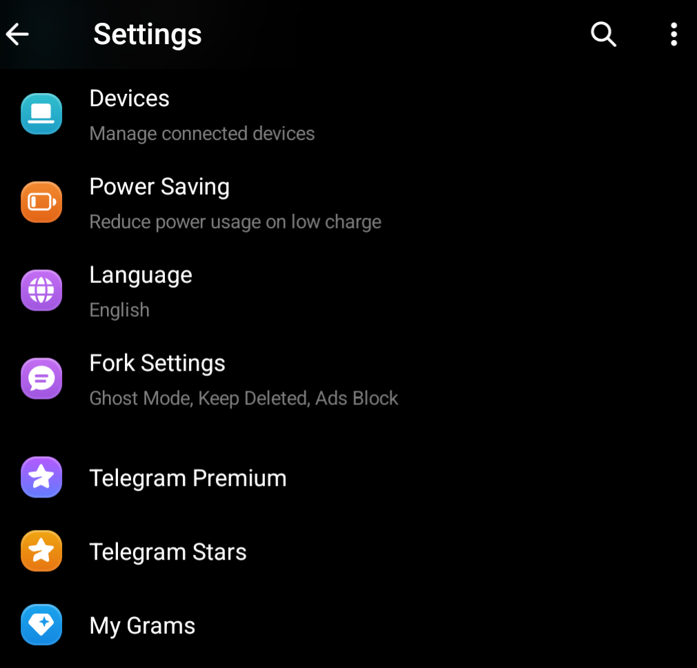
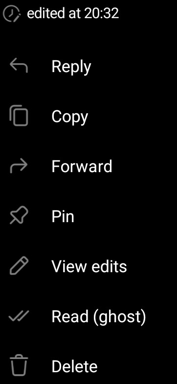

## MyGram — Fork of Telegram for Android

[Telegram](https://telegram.org) is a messaging app with a focus on speed and security. It's superfast, simple and free.

This is a modified fork of [Telegram App for Android](https://github.com/DrKLO/Telegram) with additional privacy, quality-of-life features, and complete ad removal.

## Fork Features

### 🔒 Privacy

**Ghost Mode** — Prevents sending typing status and marking messages as read. Other users won't see when you're typing, and your read receipts are suppressed.

**Keep Deleted Messages** — Prevents deletion of messages by other users. When someone deletes a message in a chat, the message is preserved on your device and shown as "Deleted message" with a trash icon.


**Keep Deleted Messages in Bots** — Same protection as above, but for messages in bot chats.

**Show Kept Deleted Messages** — Displays a visual highlight on deleted messages that were kept, so you can easily identify which messages were deleted by the other party.

### 📖 Read (Ghost)

Long-press any incoming message and select **Read (ghost)** to mark it as read on your side without sending a read receipt to the sender. Use **View edits** to see the full edit history.



### ✏️ Edit History

Long-press a message that has been edited and select **View edits** to see the full edit history of that message — original text and all subsequent versions preserved.

### 🚫 Ad-Free Experience

All advertising is completely removed from Telegram:

- **Sponsored messages** in channels — disabled
- **Video ad bulletins** during video playback — disabled
- **Sponsored message info overlays** — removed

No ads, no sponsored content, nothing interrupting your messaging or media viewing.

### 🌍 Full Localization

All fork-specific UI strings are fully translated into all 10 built-in languages:

| Language | Status |
|----------|--------|
| English | ✅ |
| Русский | ✅ |
| Українська | ✅ |
| Deutsch | ✅ |
| Español | ✅ |
| Italiano | ✅ |
| Nederlands | ✅ |
| العربية (RTL) | ✅ |
| 한국어 | ✅ |
| Português (Brasil) | ✅ |

The fork settings are available in the main Settings screen:


### ⚙️ All Fork Settings

The full list of available options:



---

## Building from Source

### Prerequisites

- Android Studio 3.4+
- Android NDK rev. 20
- Android SDK 8.1
- JDK 17

### Steps

1. Clone this repo: `git clone https://github.com/Andrey4952/MyGram.git`
2. Copy your `release.keystore` into `TMessagesProj/config`
3. Fill out `RELEASE_KEY_PASSWORD`, `RELEASE_KEY_ALIAS`, `RELEASE_STORE_PASSWORD` in `gradle.properties`
4. Go to [Firebase Console](https://console.firebase.google.com/), create an android app with your application ID, enable Firebase messaging and download `google-services.json` into `TMessagesProj/`
5. Open the project in Android Studio (open, NOT import)
6. Fill out values in `TMessagesProj/src/main/java/org/telegram/messenger/BuildVars.java`
7. Build: `./gradlew :TMessagesProj_AppStandalone:assembleAfatRelease`

### Build the release APK

```bash
export JAVA_HOME=/usr/lib/jvm/java-17-openjdk
./gradlew :TMessagesProj_AppStandalone:assembleAfatRelease
```

Output: `TMessagesProj_AppStandalone/build/outputs/apk/afat/release/app.apk` (~83 MB)

---

## Upstream Documentation

The sections below are from the original Telegram source code.

### API, Protocol documentation

Telegram API manuals: https://core.telegram.org/api

MTproto protocol manuals: https://core.telegram.org/mtproto

### Localization

We moved all translations to https://translations.telegram.org/en/android/. Please use it.

### Creating your Telegram Application

We welcome all developers to use our API and source code to create applications on our platform.
There are several things we require from **all developers** for the moment.

1. [**Obtain your own api_id**](https://core.telegram.org/api/obtaining_api_id) for your application.
2. Please **do not** use the name Telegram for your app — or make sure your users understand that it is unofficial.
3. Kindly **do not** use our standard logo (white paper plane in a blue circle) as your app's logo.
3. Please study our [**security guidelines**](https://core.telegram.org/mtproto/security_guidelines) and take good care of your users' data and privacy.
4. Please remember to publish **your** code too in order to comply with the licences.

### Compilation Guide

**Note**: In order to support [reproducible builds](https://core.telegram.org/reproducible-builds), this repo contains dummy release.keystore, google-services.json and filled variables inside BuildVars.java. Before publishing your own APKs please make sure to replace all these files with your own.

You will require Android Studio 3.4, Android NDK rev. 20 and Android SDK 8.1

1. Download the Telegram source code from https://github.com/DrKLO/Telegram ( git clone https://github.com/DrKLO/Telegram.git )
2. Copy your release.keystore into TMessagesProj/config
3. Fill out RELEASE_KEY_PASSWORD, RELEASE_KEY_ALIAS, RELEASE_STORE_PASSWORD in gradle.properties to access your release.keystore
4. Go to https://console.firebase.google.com/, create two android apps with application IDs org.telegram.messenger and org.telegram.messenger.beta, turn on firebase messaging and download google-services.json, which should be copied to the same folder as TMessagesProj.
5. Open the project in the Studio (note that it should be opened, NOT imported).
6. Fill out values in TMessagesProj/src/main/java/org/telegram/messenger/BuildVars.java – there's a link for each of the variables showing where and which data to obtain.
7. You are ready to compile Telegram.